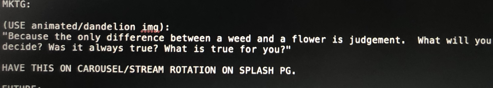

### LEAN: Living Emotional Awareness Now
#### What will you lean into?
<h1 align="center">
  <a href="https://avatars3.githubusercontent.com/u/34698193?s=460&u=ab64d9d2675a32784f4c56b936876b9d85e245c3&v=4&imgrefurl=https%3A%2F%2Fwww.travelandleisure.com%2Fslideshows%2Fbest-restaurants-open-on-christmas&docid=XQ496gQQlk3zuM&tbnid=Svoa8v5w8ClfUM%3A&vet=10ahUKEwiJ_PjD3aHlAhXKvZ4KHQbVCwQQMwh5KAEwAQ..i&w=1600&h=1000&bih=481&biw=1286&q=best%20restaurant&ved=0ahUKEwiJ_PjD3aHlAhXKvZ4KHQbVCwQQMwh5KAEwAQ&iact=mrc&uact=8">
    Catalogue Content for LEAN Prj App
  </a>
</h1>

<!-- : An upcoming [Heroku](https://git.heroku.com/welean.git) app -->

[BRAINSTORM](BRAINSTORM)

==========
LEAN is a fullstack app composed of:

* [React web frontend](client/README.md)
* [Node backend](server/README.md)
  
## Dev Technologies

* [Heroku](https://heroku.com): A live app service.
* [React](https://reactjs.org/): A frontend library framework.
* [Mocha](http://mochajs.org/): A test framework.
* [Karma](https://karma-runner.github.io): a productive testing environment to developers.
* [Eslint](http://eslint.org/): The pluggable linting utility for JavaScript and JSX.
* [Mongo](https://mongodb.com): A general purpose, document-based, distributed database.
* [Mongoose](https://mongoosejs.com): An object modeling tool designed to work in an asynchronous environment.and node.js
* [Reactstrap](reactstrap.github.io): React Bootstrap 4 components.
* [Dotenv](https://www.npmjs.com/package/dotenv): A zero-dependency module that loads environment variables.
  
## Installed Packages
<pre>

- React: npx create-react-app myapp
- Reactstrap: npm i bootstrap
- npm i reactstrap react react-dom 
- - mongodb
- mongoose
- express
- fs
- dotenv: npm install dotenv 
</pre>

## Priors Versions
Here are repos built refining the product.
Their version are as follows: 
* [CurrentRepo](https://github.com/QuietEvolver/we-lean)
* [rgb-survey](https://quietevolver.github.io/rgb-survey/)
* [ean](https://quietevolver.github.io/ean/)
* [welean](https://quietevolver.github.io/welean/)
* [lean]:(has the amz build in outer folder housing/welean)
* [weleanfull](https://quietevolver.github.io/weleanfull/)
* [lean-ean](https://github.com/QuietEvolver/lean-ean/capstone-submit-working)
* [rn-lean-app](https://quietevolver.github.io/RN-lean-app/)
* [vera-native-lean](https://quietevolver.github.io/vera-native-lean/)
* [react-with-api](https://quietevolver.github.io/react-with-api/)
* [travel-guide-and-survey](https://quietevolver.github.io/travel-guide-and-survey/):(former project code refactor for js: ui & c#:be)
* [travel-guide-ap](https://quietevolver.github.io/travel-guide-api/)
* [survey-react]:(no gh page)

## License

[LICENSE](LICENSE)

## Author

Contact: [Vera](quietevolver99-noreply@github.com)

This project was bootstrapped with [Create React App](https://github.com/facebook/create-react-app).
## App
Click [Heroku](https://git.heroku.com/welean.git) app for live view

## Available Scripts

In the project directory, you can run:

### `npm start`

Runs the app in the development mode. 
Open [http://localhost:3000](http://localhost:3000) to view it in the browser.. 

### `npm test`

Launches the test runner in the interactive watch mode. 
See the section about [running tests](https://facebook.github.io/create-react-app/docs/running-tests) for more information.

### `npm run build`

Builds the app for production to the `build` folder. 
It correctly bundles for production mode and optimizes build for best performance.

The build is minified and the filenames include the hashes. 
Your app is ready to be deployed!

See the section about [deployment](https://facebook.github.io/create-react-app/docs/deployment) for more information.

## Learn More

You can learn more in the [Create React App documentation](https://facebook.github.io/create-react-app/docs/getting-started).

To learn React, check out the .

### Code Splitting

This section has moved here: https://facebook.github.io/create-react-app/docs/code-splitting

### Analyzing the Bundle Size

This section has moved here: https://facebook.github.io/create-react-app/docs/analyzing-the-bundle-size

### Making a Progressive Web App

This section has moved here: https://facebook.github.io/create-react-app/docs/making-a-progressive-web-app

### Advanced Configuration

This section has moved here: https://facebook.github.io/create-react-app/docs/advanced-configuration

### Deployment

This section has moved here: https://facebook.github.io/create-react-app/docs/deployment

### `npm run build` fails to minify

This section has moved here: https://facebook.github.io/create-react-app/docs/troubleshooting#npm-run-build-fails-to-minify

